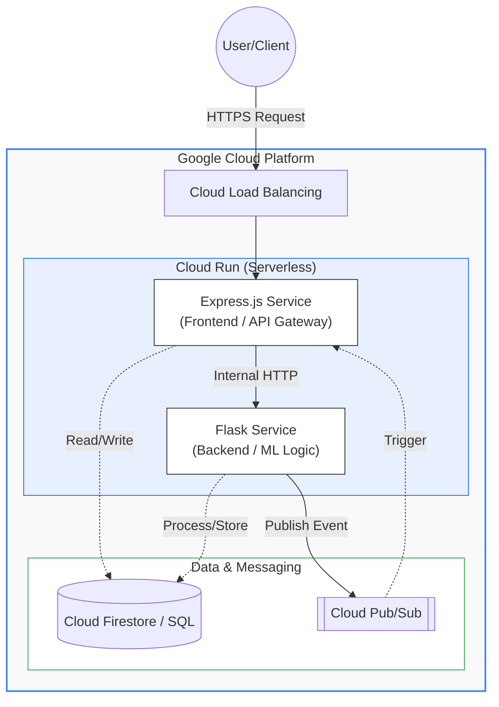

## Heres a mermaid chart of cloud run template:

```mermaid
    graph TD
        %% Define Actors and Components
        User((User/Client))

        subgraph GCP ["Google Cloud Platform"]
            LB[Cloud Load Balancing]

            subgraph CloudRun ["Cloud Run (Serverless)"]
                Express["Express.js Service<br/>(Frontend / API Gateway)"]
                Flask["Flask Service<br/>(Backend / ML Logic)"]
            end

            subgraph DataLayer ["Data & Messaging"]
                Firestore[(Cloud Firestore / SQL)]
                PubSub[[Cloud Pub/Sub]]
            end
        end

        %% Define Connections
        User -->|HTTPS Request| LB
        LB --> Express

        %% Service to Service Communication
        Express -->|Internal HTTP| Flask

        %% Data Access
        Express -.->|Read/Write| Firestore
        Flask -.->|Process/Store| Firestore

        %% Asynchronous Tasks
        Flask -->|Publish Event| PubSub
        PubSub -.->|Trigger| Express

        %% Styling
        style GCP fill:#f9f9f9,stroke:#4285F4,stroke-width:2px
        style CloudRun fill:#e8f0fe,stroke:#1a73e8
        style DataLayer fill:#fff,stroke:#34a853
        style Express fill:#fff,stroke:#333
        style Flask fill:#fff,stroke:#333
```
