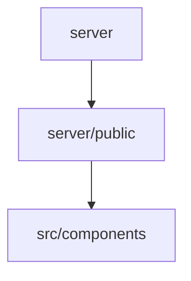

# 📚 tasteslikegoodtheangularsvegancookbook Documentation

Welcome to the complete documentation for this repository. This documentation is automatically generated and maintained by Woden Docbot.

  

## 🔗 Quick Links

[📂 server](./server/README.md) | [📂 src](./src/README.md)
[📋 Dependencies](./DEPENDENCIES.md)

---

> An Angular + TypeScript application with a Node-based server runtime and organized UI component sources for a vegan cookbook-style site.

## 📖 Overview

This repository contains an Angular/TypeScript front-end component tree and a Node.js server runtime that classifies routes and serves static assets. The server/ directory provides the runtime entry point (index.ts), a centralized route manifest (route-manifest.ts), Vitest tests that validate routing and the checked-in /about static page, and a public/ folder with about.html. The src/ directory is the home for UI component implementations and organizes components under src/components so each UI piece is encapsulated and discoverable.

The codebase is built with TypeScript and Angular on the UI side and Node.js/Express-style server code on the runtime side, with tooling and test dependencies such as Vite and Vitest. Styling and markup files (HTML, CSS, Tailwind CSS) and standard linting/formatting tools appear in the manifests and dependency list.

### 🧩 Key Components

| Component | Purpose | Technologies |
| --- | --- | --- |
| **server** | Runtime entry point and centralized route-classification logic with tests that validate routing behavior and static page content. | `TypeScript`, `Node.js`, `Express` |
| **server/public** | Static public assets exposed directly by the server; includes the complete about.html page used by tests. | `HTML` |
| **src/components** | Organized home for UI component implementations; each component is intended to live in its own subdirectory to group related source files. | `Angular`, `TypeScript`, `HTML` |

**Component Architecture:**

### 🏗️ Architecture

A split layout with a Node.js/TypeScript server directory handling routing and static assets and a src directory organizing Angular UI components; tests live alongside server code and static pages.

### 💡 Use Cases

- ✦ Classify incoming requests and map them to routes via the server route manifest
- ✦ Serve static public pages such as the checked-in about.html
- ✦ Host and organize Angular UI component implementations for the application

### 🔧 Technologies

**Languages:**  

**Frameworks:**  
        

### 📦 External Dependencies

The following external packages are used across the project:

- `@angular-eslint/eslint-plugin`
- `@angular/cli`
- `@angular/compiler-cli`
- `@angular/core`
- `@google-cloud/secret-manager`
- `@types/node`
- `eslint`
- `express`
- `ioredis`
- `prettier`
- `rxjs`
- `tailwindcss`
- `typescript`
- `vite`
- `vitest`

---

## 📑 Documentation Sections

### [server](./server/README.md)
Contains the server-side runtime entry point, a centralized route-classification manifest with helpers, and related unit tests plus a public assets directory for static pages.

This directory provides the server-side runtime surface and the route-classification logic used to map incoming requests to routing and metering decisions.

### [src](./src/README.md)
Holds source documentation and UI component implementations used by the application, organizing component code into dedicated subdirectories.

This directory is the source documentation area and the home for UI components used by the application.

---

## 📊 Documentation Statistics

- **Files Documented**: 6
- **Directories**: 6
- **Coverage**: 4%
- **Eligible Source Files**: 161
- **Last Updated**: 2026-09-27

---

## 🧭 How to Navigate

> ℹ️ **INFO**
> Each directory has its own README.md with detailed information about that section. Use the breadcrumb navigation at the top of each page to navigate back to parent directories.

### Navigation Features

- **Breadcrumbs** - At the top of each page, showing your current location
- **Directory READMEs** - Each folder has a comprehensive overview
- **File Documentation** - Click through to individual file documentation
- **Search** - Use GitHub's search or your IDE's search functionality

---

## 🤖 About Woden DocBot

This documentation is automatically generated and kept up-to-date by Woden DocBot, an AI-powered documentation assistant. DocBot analyzes code on every pull request and updates documentation to reflect changes.

### Features

- **Automatic Updates** - Documentation updates on every PR
- **Comprehensive Coverage** - Files, functions, classes, and directories
- **Smart Navigation** - Breadcrumbs, related files, and parent links
- **AI-Powered** - Uses Azure GPT models for intelligent documentation generation

---

*Generated by Woden DocBot for tasteslikegoodtheangularsvegancookbook*