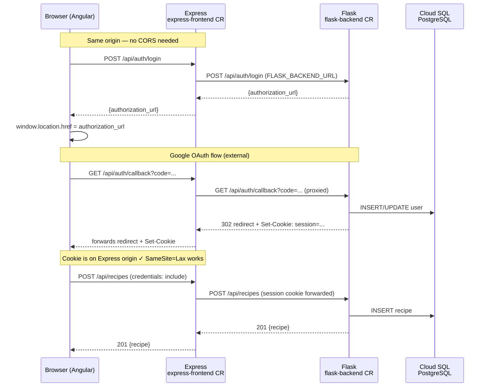

# ADR-001: Auth & Persistence Routing — Express Server-Side Proxy vs. Angular Direct CORS

**Status:** Accepted  
**Date:** 2026-03-03  
**Deciders:** Engineering  
**Phase:** IV — Connecting Angular frontend to Flask persistence endpoints

---

## Context

The application is a three-tier system entering Phase IV:

```
Angular SPA (Browser)
    │
    ├── /api/recipe, /api/image  →  Express (Cloud Run: express-frontend)
    │                                  └── Gemini / Imagen AI calls
    │
    └── /api/auth/*, /api/recipes/*, /api/collections/*  →  Flask (Cloud Run: flask-backend)
                                                              └── Cloud SQL (PostgreSQL)
```

The Terraform template (`app-template-5-main.tf`) has already:

- Split into two Cloud Run services: `express-frontend` and `flask-backend`
- Injected `flask_backend_SERVICE_ENDPOINT` as an env var into `express-frontend`
- Given `flask-backend` `roles/cloudsql.client` IAM access to the PostgreSQL instance

Flask uses **server-side sessions** (not JWT) for Google OAuth. The Angular `AuthService` currently calls all Flask endpoints via relative paths (`flaskApiUrl: ''`), forwarded through the Express server's built-in `/api/auth` reverse proxy (`server/proxy.ts`).

### The Decision Required

How should the Angular frontend reach the Flask backend for **all Phase IV endpoints** (auth + recipe/cookbook persistence)?

**Option A — Express Server-Side Proxy (status quo, extended)**  
Angular calls everything relative → Express forwards to Flask via `FLASK_BACKEND_URL`.

**Option B — Angular Direct CORS Calls**  
Angular knows the Flask Cloud Run URL at build time → calls Flask directly with `credentials: 'include'`.

---

## Decision Drivers

| Driver                                                                     | Weight |
| -------------------------------------------------------------------------- | ------ |
| Session-cookie auth (no JWT) must survive browser same-origin restrictions | High   |
| OAuth redirect_uri must match the URL the browser is actually on           | High   |
| Consistency between dev and production                                     | High   |
| Avoid CORS `SameSite=None; Secure` cookie complexity                       | High   |
| Minimize changes to working code                                           | Medium |
| Angular bundle must not contain Flask's Cloud Run URL (changes per deploy) | Medium |

---

## Options Considered

### Option A: Express Server-Side Proxy ✅ (Chosen)

```
Browser → Express (:8080 / express-frontend Cloud Run)
              ├── /api/recipe, /api/image  → handled locally (Gemini)
              └── /api/auth/*, /api/recipes/*, /api/collections/*
                        → proxied to Flask via FLASK_BACKEND_URL env var
```

**How it works:**

- `server/proxy.ts` already implements a raw HTTP proxy for `/api/auth/*`
- Extend the proxy (or mount a second proxy) for `/api/recipes/*` and `/api/collections/*`
- Flask's `FLASK_BACKEND_URL` is read from the env var (`flask_backend_SERVICE_ENDPOINT`) injected by Terraform — never hardcoded in the Angular build
- Angular `flaskApiUrl` stays `''` in both environments; no build-time URL needed
- Session cookies are set on the `express-frontend` origin — same origin as the SPA → no CORS, no `SameSite=None`
- OAuth `redirect_uri` in Flask points to `express-frontend` domain → callback flows back through Express → Flask session is established server-side

**Sequence: Google OAuth login**

```
1. Angular    →  POST /api/auth/login           (Express, relative)
2. Express    →  POST /api/auth/login           (Flask, internal)
3. Flask      ←  {authorization_url: "https://accounts.google.com/..."}
4. Express    →  Angular: returns authorization_url
5. Angular       window.location.href = authorization_url
6. Google     →  Redirect to redirect_uri (on express-frontend domain)
7. Express    →  GET /api/auth/callback         (Flask, proxied)
8. Flask         validates OAuth code, sets server-side session
9. Flask      →  Set-Cookie: session=...; HttpOnly; SameSite=Lax
10. Express   →  forwards Set-Cookie header to browser
11. Angular      cookie is now on express-frontend origin ✓
```

**Pros:**

- ✅ Already built — `server/proxy.ts` and `createAuthProxy()` exist and work
- ✅ Session cookies are same-origin; `SameSite=Lax` works (most secure default)
- ✅ OAuth redirect_uri resolves to one domain — no origin mismatch
- ✅ `flaskApiUrl: ''` unchanged in Angular — zero frontend env var changes
- ✅ Flask URL stays server-side only (env var on Express) — not in Angular bundle
- ✅ Dev and prod are identical: dev uses `proxy.conf.json` (ng serve) or `server/proxy.ts` (npm start); prod uses the same `server/proxy.ts` with Cloud Run URL

**Cons:**

- ⚠ Small extra latency: browser → Express → Flask (mitigated by VPC internal routing between Cloud Run services)
- ⚠ Express proxy must be extended to cover new routes (`/api/recipes/*`, `/api/collections/*`)
- ⚠ Express becomes a dependency for Flask availability (already the case for auth)

---

### Option B: Angular Direct CORS Calls ❌ (Rejected)

```
Browser → Express (:8080)          /api/recipe, /api/image
Browser → Flask (Cloud Run URL)    /api/auth/*, /api/recipes/*
```

**Why rejected:**

1. **SameSite cookie problem.** Flask sessions are cookies. When Flask is on a different origin (e.g., `flask-backend-xyz-uw.a.run.app`) from the Angular SPA (`express-frontend-xyz-uw.a.run.app`), the browser requires `SameSite=None; Secure`. This is a known footgun: it requires HTTPS on both origins (fine for Cloud Run, problematic for local dev) and forces a Flask session config change.

2. **OAuth redirect_uri complexity.** Flask's `url_for("auth.callback", _external=True)` would generate a URL pointing to Flask's Cloud Run domain, not the Angular SPA's domain. After OAuth, the browser lands on Flask's domain — but the SPA is on Express's domain. A manual redirect back to Express is needed, adding state management complexity.

3. **Flask URL in Angular build.** `environment.prod.ts` would need to be parameterised with the Flask Cloud Run URL, which changes per environment and is a secret-adjacent value. Vite would inline it into the JS bundle.

4. **Two CORS origins.** Express needs CORS headers for AI endpoints, Flask needs CORS for persistence endpoints. Debugging cross-origin cookie failures is difficult.

5. **Breaks existing dev setup.** `proxy.conf.json` and `server/proxy.ts` already route `/api/auth/*` through Express — Option B would require removing this and changing how Angular dev server works.

---

## Decision

**Option A — Express Server-Side Proxy — is the correct architectural choice** for this application.

The pattern is already proven for `/api/auth/*`. Phase IV work is to extend the same proxy to cover `/api/recipes/*` and `/api/collections/*`.

---

## Implementation Plan for Phase IV

### 1. Extend `server/proxy.ts` to cover persistence routes

```typescript
// server/proxy.ts — add alongside createAuthProxy()
export function createFlaskProxy(pathPrefix: string) {
  // Same implementation as createAuthProxy(), parameterised by prefix
}
```

```typescript
// server/index.ts — mount before express.json()
app.use('/api/auth', createFlaskProxy('/api/auth'));
app.use('/api/recipes', createFlaskProxy('/api/recipes'));
app.use('/api/collections', createFlaskProxy('/api/collections'));
```

Or consolidate into a single middleware that proxies any `/api/*` route not handled by Express locally.

### 2. Flask endpoints to implement (Backend/)

Per `ARCHITECTURE_RECOMMENDATION.md` Phase 4 API design:

```
GET    /api/recipes              # List user's saved recipes
POST   /api/recipes              # Save recipe (from Angular)
GET    /api/recipes/:id          # Get recipe
PUT    /api/recipes/:id          # Update recipe
DELETE /api/recipes/:id          # Delete recipe

GET    /api/collections          # List cookbooks
POST   /api/collections          # Create cookbook
POST   /api/collections/:id/recipes  # Add recipe to cookbook
DELETE /api/collections/:id      # Delete cookbook
```

All endpoints must be `login_required` — unauthenticated calls return `401`, Angular falls back to `localStorage`.

### 3. Angular `AuthService` changes

- `saveRecipe()`, `createCookbook()`, etc. remain as-is for **guest users** (`localStorage` only)
- Add a **hybrid persistence layer**: if `currentUser().isGuest === false`, POST to `/api/recipes` after saving to `localStorage`; on startup, load from API and merge
- `flaskApiUrl` stays `''` — no environment changes needed

### 4. FLASK_BACKEND_URL in production

The Terraform template already injects `flask_backend_SERVICE_ENDPOINT` into the `express-frontend` Cloud Run service. Rename to match Express's expected env var name:

```hcl
# app-template-5-main.tf (express-frontend container env_vars)
"FLASK_BACKEND_URL" = module.flask-backend.service_uri
```

This matches `server/index.ts`:

```typescript
const flaskUrl = process.env.FLASK_BACKEND_URL || 'http://localhost:5000';
```

---

## Consequences

### Positive

- Auth, recipe save, and cookbook management all work over the same origin — zero CORS configuration needed on Flask for browser clients
- Session cookies use `SameSite=Lax; HttpOnly; Secure` — most secure default
- OAuth flow is clean: one domain throughout the entire redirect cycle
- Angular code changes are minimal: same relative URLs, same `credentials: 'include'` pattern already in `AuthService`
- Dev parity: same proxy code runs locally (`server/proxy.ts`) and in production (Cloud Run internal VPC)

### Negative / Trade-offs

- Express is now a required intermediary for Flask calls — if Express is down, Flask is also unreachable from the browser (acceptable: they scale together on Cloud Run)
- Internal Flask calls add ~1–5ms latency (Cloud Run VPC internal routing; negligible for persistence ops)
- Express proxy must be maintained alongside Flask API evolution (low overhead)

### Neutral

- Flask CORS headers (`flask-cors`) are still useful for **server-to-server** calls or future admin tooling, but are not required for the Angular SPA

---

## Architecture Diagram



---

## References

- `server/proxy.ts` — existing auth proxy implementation
- `server/index.ts:27` — `app.use("/api/auth", createAuthProxy())`
- `Google Cloud App Designs/app-template-5-main.tf` — Terraform: `flask_backend_SERVICE_ENDPOINT` in express-frontend env
- `Google Cloud App Designs/gemini_ref_aewser.md` — Google's guidance on Cloud Run service-to-service communication
- `docs/ARCHITECTURE_RECOMMENDATION.md` — Phase 4 API design reference
- `src/services/auth.service.ts` — Angular auth service (calls `/api/auth/*` as relative URLs)
- `src/environments/environment.ts` — `flaskApiUrl: ''` (relative, proxied)

---

_Co-authored-by: Copilot <223556219+Copilot@users.noreply.github.com>_
