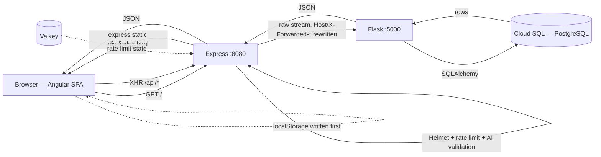
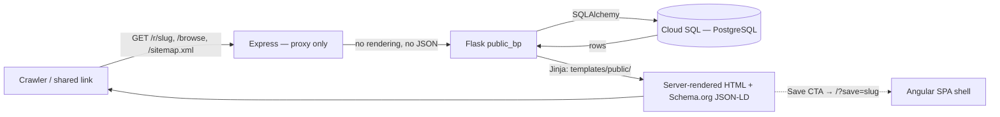

# Frontend ↔ Backend Architecture

How a request actually moves through Vegangenius Chef. Verified against the code
at the time of writing; file and line references are included so this page can be
re-checked rather than trusted.

> **If you arrived here from a generic "Angular + Express + Flask on Cloud Run"
> reference diagram, read [Common misreadings](#common-misreadings) first.** The
> stock version of that architecture puts Angular SSR in the Node tier and treats
> Flask as a headless JSON API. This app deliberately does the opposite.

## The two surfaces

The app presents **two document families that never share a runtime**:

| Surface                                               | Rendered by                  | Express's role      |
| ----------------------------------------------------- | ---------------------------- | ------------------- |
| The SPA (`/`, `/kitchen`, `/recipe/:id`)              | Browser, from a static shell | Serves static files |
| Public pages (`/r/<slug>`, `/browse`, `/sitemap.xml`) | Flask + Jinja, server-side   | Transparent proxy   |

They are linked by navigation, not by hydration. There is no shared client-side
state between them and no serialized-state handoff.

---

## 1. SPA + API flow

The initial document is a **static shell**. `server/index.ts:166-168` answers the
SPA catch-all with `dist/index.html` off disk — no template engine, no data
injection, no Flask call. Angular boots in the browser, takes over routing, and
fetches its own data over `/api/*`.

Because the browser only ever talks to Express, Angular uses relative URLs
exclusively and there is no CORS surface between the tiers.

## 2. Public SSR flow

`server/index.ts:141-164` mounts these routes on `createFlaskProxy('SSR')`
**before** the SPA catch-all, so a crawler receives fully rendered HTML instead of
an empty shell. Express does not render, parse, or transform anything on this
path — it forwards bytes and streams the response back.

Flask owns the rendering end to end: `Backend/blueprints/public_bp.py` defines
`/r/<slug>` (line 261), `/browse` (line 315), and `/sitemap.xml` (line 357), and
calls `render_template` against `Backend/templates/public/`
(`base_public.html`, `recipe.html`, `browse.html`) with SQLAlchemy models.

`/static/*` is proxied to Flask as well. Without it those stylesheet requests fall
through to the SPA catch-all and come back as `index.html` with a `text/html`
content-type, which Helmet's `nosniff` header makes the browser refuse — the public
pages render completely unstyled.

The bridge back into the app is a link, not a hydration step: the "Save to your
cookbook" CTA navigates to the SPA with `?save=<slug>`, which
`src/guards/ssr-entry.guard.ts:12-16` picks up and hands to `SsrEntryService`.

---

## Express is a proxy, not a render tier

`server/proxy.ts` is a hand-rolled reverse proxy over Node's built-in
`http`/`https` — no `http-proxy-middleware`, no proxy dependency at all. It is
mounted **before** `express.json()` so request bodies stream to Flask unconsumed.

The only headers it rewrites are `Host` (set to the Flask target so Cloud Run's
load balancer routes correctly) and `X-Forwarded-Host` / `X-Forwarded-Proto` (so
Flask's `ProxyFix` and `url_for(_external=True)` resolve back to the browser's
origin).

**Express holds no credentials.** It does not append API keys, tokens, or secrets
to Flask requests. The Gemini and OAuth credentials live in Flask, injected from
Google Secret Manager at Cloud Run runtime. A grep for `API_KEY` across `server/`
returns nothing.

## What Express does own

Everything the request-flow diagrams elide, all in `server/index.ts`:

- **Canonical-host redirect** — the apex `tasteslikegood.org` 301s (308 for
  non-GET) to `https://www.tasteslikegood.org` for all paths, before any other
  route. Re-parsed against a fixed origin so a crafted path can't turn it into an
  open redirect.
- **Rate limiting** — 300 requests / 15 min per IP on `/api`, and 20 / hour on
  the two AI endpoints (`server/security.ts:55-78`). The same general limiter is
  reused for the static shell and SSR routes.
- **Valkey** — backs the rate limiter with shared state across Express replicas,
  falling back to in-memory when unavailable (`server/valkey.ts`).
- **Helmet + request logging**, applied before the proxy so headers and telemetry
  cover proxied `/api/*` traffic too.
- **AI input validation** — `server/validation.ts` buffers and validates the JSON
  body of `POST /api/generate` and `/api/generate_image` under a 10kb cap
  (`AI_REQUEST_BODY_LIMIT`), then stashes the raw bytes on `req.rawBody` for the
  proxy to replay to Flask verbatim. Every other `/api/*` route keeps raw
  streaming.
- **Static assets** — the Angular bundle from `dist/`, plus explicit routes for
  `/privacy-policy` and `/favicon.ico` that must precede the SPA catch-all.
- **Graceful shutdown** — drains in-flight HTTP, stops the Valkey token-refresh
  timer, closes the connection.

## The write path can skip the database

`PersistenceService` writes **localStorage first** for instant UI feedback, then
syncs to Flask; on network failure it falls back to localStorage so the UI keeps
working (`src/services/persistence.service.ts:76,145`). Guest data is merged into
the authenticated session on OAuth login.

So the client is briefly authoritative. Cloud SQL is the durable source of truth,
but a request/response diagram alone will not show you that.

## Deployment topology

Two Cloud Run services and one Cloud Run **Job** in `us-central1`:

- `express-frontend` — Node, port 8080, public
- `flask-backend` — Python/gunicorn, port 5000, no public auth
- `flask-backend-migrate` — **Job**, runs `flask db upgrade` before each Flask
  service deploy; a failure aborts the build and the old revision keeps serving

`cloudbuild.yaml` builds both images, runs the migrate Job to completion, then
deploys Flask and Express in sequence.

---

## Common misreadings

These come up because the framework list (Angular + Express + Flask + Postgres +
Cloud Run) matches a very common reference architecture that this app does not
follow. Each was checked against the code:

| Common claim                                            | Reality here                                                                                                                |
| ------------------------------------------------------- | --------------------------------------------------------------------------------------------------------------------------- |
| Express runs Angular SSR (`@angular/ssr`)               | No. Neither `@angular/ssr` nor `@angular/platform-server` is a dependency; `angular.json` has no server build target.       |
| The SSR page hydrates into the SPA                      | No. No `provideClientHydration`, no `TransferState` anywhere in `src/`. The two surfaces are separate documents.            |
| Express calls Flask for JSON, then renders HTML with it | Inverted. Flask renders the HTML; Express forwards bytes and never sees JSON on that path.                                  |
| Flask is a pure headless API with no Jinja templates    | No. `render_template` is used in `public_bp.py`, `recipes_bp.py`, `generation_bp.py`, and the 404/500 handlers in `app.py`. |
| Express uses `http-proxy-middleware`                    | No. Hand-rolled on `node:http`/`https`, deliberately zero-dependency.                                                       |
| Express appends private API keys to Flask requests      | No. Express holds no credentials; secrets are Flask-side via Secret Manager.                                                |
| The API is REST/GraphQL                                 | REST only. There is no GraphQL layer.                                                                                       |
| There is a `/home` route                                | No. SPA routes are `/`, `/kitchen`, `/recipe/:id`; public routes are `/r/<slug>` and `/browse`.                             |

## Why this shape

- **SEO without a Node render tier.** The public surface is the part that needs to
  be crawlable, and it is content-driven and cacheable. Jinja renders it directly
  from the models that already exist in Flask, with no second data-fetching layer
  and no serialization contract between tiers.
- **The app surface doesn't need SSR.** `/kitchen` and `/recipe/:id` are
  auth-walled and personalized — there is nothing for a crawler to index and no
  first-paint content a server could usefully pre-render.
- **One origin, no CORS.** Express fronts everything, so Angular only ever issues
  relative requests.
- **Independent scaling.** The two Cloud Run services scale on unrelated signals —
  static/proxy traffic versus AI generation and database load.

## Source references

| Concern                       | File                                                                 |
| ----------------------------- | -------------------------------------------------------------------- |
| Route mounting order          | `server/index.ts`                                                    |
| Reverse proxy                 | `server/proxy.ts`                                                    |
| Helmet, rate limiters, logger | `server/security.ts`                                                 |
| Valkey client + fallback      | `server/valkey.ts`                                                   |
| AI endpoint validation        | `server/validation.ts`                                               |
| Public SSR routes             | `Backend/blueprints/public_bp.py`                                    |
| Public SSR templates          | `Backend/templates/public/`                                          |
| SSR → SPA entry handoff       | `src/guards/ssr-entry.guard.ts`, `src/services/ssr-entry.service.ts` |
| localStorage-first writes     | `src/services/persistence.service.ts`                                |
