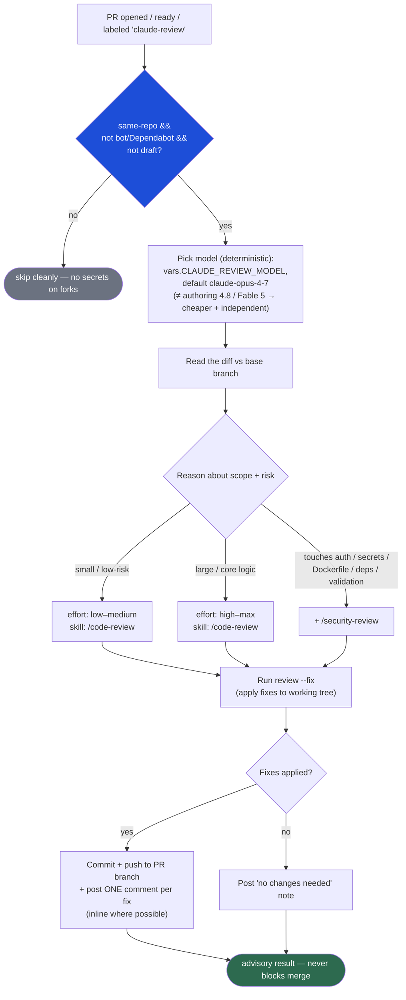

# Claude Independent-Model Review — decision flow

GitHub-renderable Mermaid source. Canonical context:
[SPEC-03-claude-independent-review.md](SPEC-03-claude-independent-review.md).

An **advisory** PR reviewer that runs in its own CI session with a **different,
cheaper model** than the authoring session (author works in Opus 4.8 / Fable 5;
reviewer uses an Opus 4.x < 4.8) — breaking the self-review monoculture at lower
cost. It reasons about scope, picks the review skill + reasoning effort, applies
fixes, and leaves a comment per fix. It is **never** a required check
(SPEC-02 rule 1) and **fails open**.

**Cost controls:** runs once per PR (`opened` / `ready_for_review`), on-demand via
the `claude-review` label or `workflow_dispatch` — **not** on every `synchronize`
push; `concurrency` cancels superseded runs; the model is always the cheaper
Opus 4.x tier.
