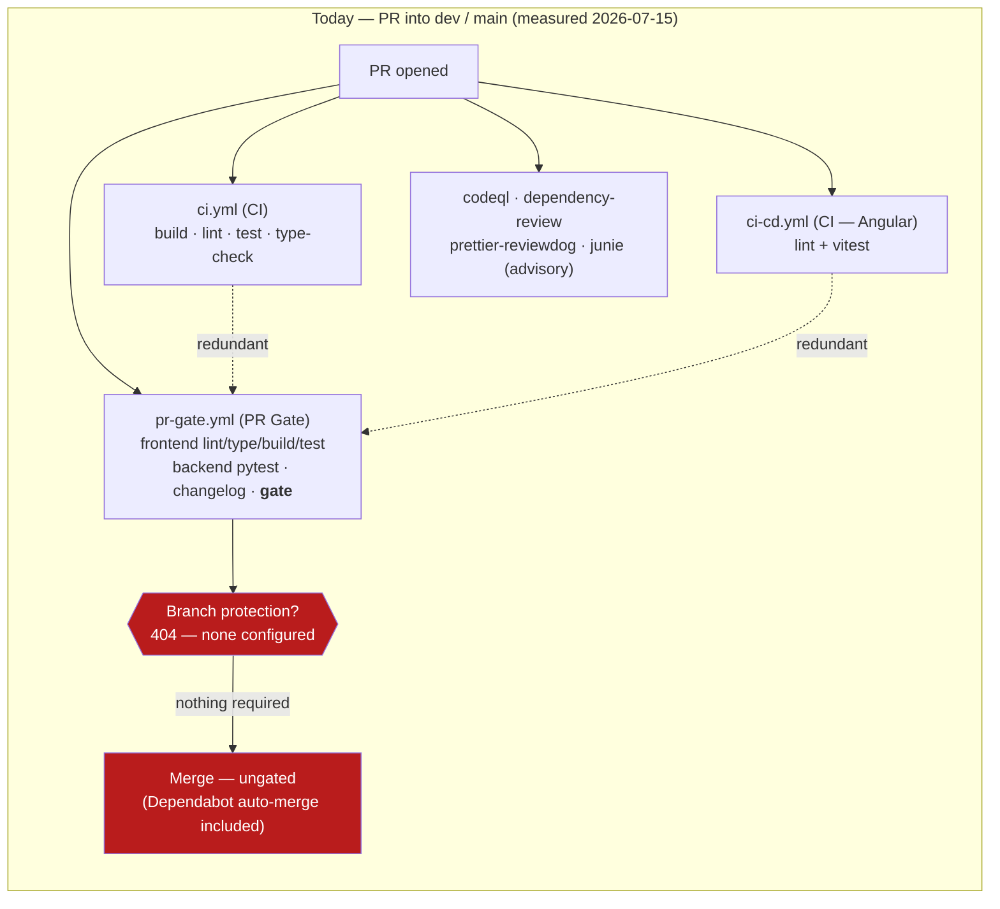

# Current State — Cookbook CI on `dev` / `main` (measured 2026-07-15)

GitHub-renderable Mermaid source. Canonical context:
[SPEC-01-ci-quality-gates.md](SPEC-01-ci-quality-gates.md).

The headline: **no branch is protected.** `pr-gate.yml` builds an aggregate
`Gate — all checks passed` job that its own header calls "the single required
check" — but `gh api .../branches/{dev,main}/protection` returns `404 Branch not
protected` for both. Every PR, including Dependabot auto-merges, can land with
zero required checks. Three workflows also run the same lint/test/build on
every PR.

**Redundancy:** `npm ci` + lint + test run in `ci.yml`, `pr-gate.yml`, and
`ci-cd.yml` on the same PR. `ci-cd-backend.yml` runs backend pytest but only on
PRs into `main`, so it never fires on the `dev` PRs where all feature work
lands (pr-gate's `backend-test` covers `dev`, making `ci-cd-backend.yml`
redundant and narrower).

**Not shown / no gate at all:** CI never builds the production Docker images.
The v0.3.4 release tag burned on an Express `Dockerfile` `NODE_OPTIONS`/`ENV`
syntax bug that no CI job would ever have caught (see commit `4e5582c`,
"repairs v0.3.4 deploy").
