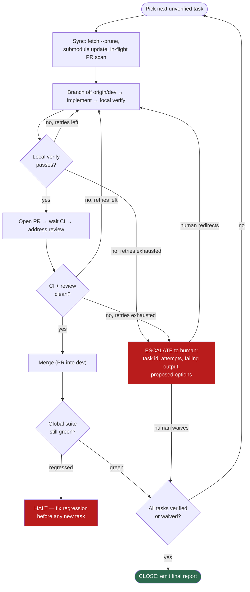

# Agent-Harness Loop — CI Refresh execution

GitHub-renderable Mermaid source. Canonical context:
[PROMPT.md](PROMPT.md). This is the bounded loop the `agent-harness` /
`agent-harness:cs-harness` driver runs over the task table in PROMPT.md: every
task has a machine verify, a retry cap, and an escalation path; the loop refuses
to close until every task is verified green or explicitly human-waived.

**Hard escalation points (never improvise):** branch-protection changes
(Phase 4 — always escalate before applying), scoping/altering
`gc-build-deploy.yml` deploy behavior, retries exhausted, or an in-flight PR by
someone else overlapping a task.
