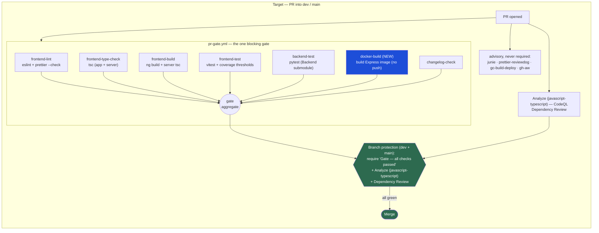

# Target Pipeline — Cookbook CI after SPEC-01

GitHub-renderable Mermaid source. Canonical context:
[SPEC-01-ci-quality-gates.md](SPEC-01-ci-quality-gates.md).

One authoritative PR gate (`pr-gate.yml` → aggregate `Gate — all checks passed`
context), a new Docker-build job so image breakage is caught before the deploy
tag, and branch protection that actually requires the gate. Redundant
lint/test/build in `ci.yml` and `ci-cd.yml` is retired; the narrow
`ci-cd-backend.yml` is deleted (pr-gate already covers backend on `dev`).

Notes:

- **CodeQL context is per-language.** The matrix job name is
  `Analyze (javascript-typescript)`; requiring a context named `CodeQL`
  (the workflow name) would block every PR forever on a check that never
  reports.
- **AI / agentic workflows stay advisory.** `junie-review`, `junie-tag`,
  `prettier-reviewdog`, `gc-build-deploy`, and the gh-aw workflows
  (`daily-repo-status`, `issue-arborist`, `agentics-maintenance`,
  `relevance-summary`) must never enter the required-check list — see
  [SPEC-02](SPEC-02-ai-and-deploy-workflows.md).
- **Docker-build job is the one genuinely new gate.** Frontend build already
  runs; what is missing is building the *image* the way prod does, which is
  where v0.3.4 broke.
