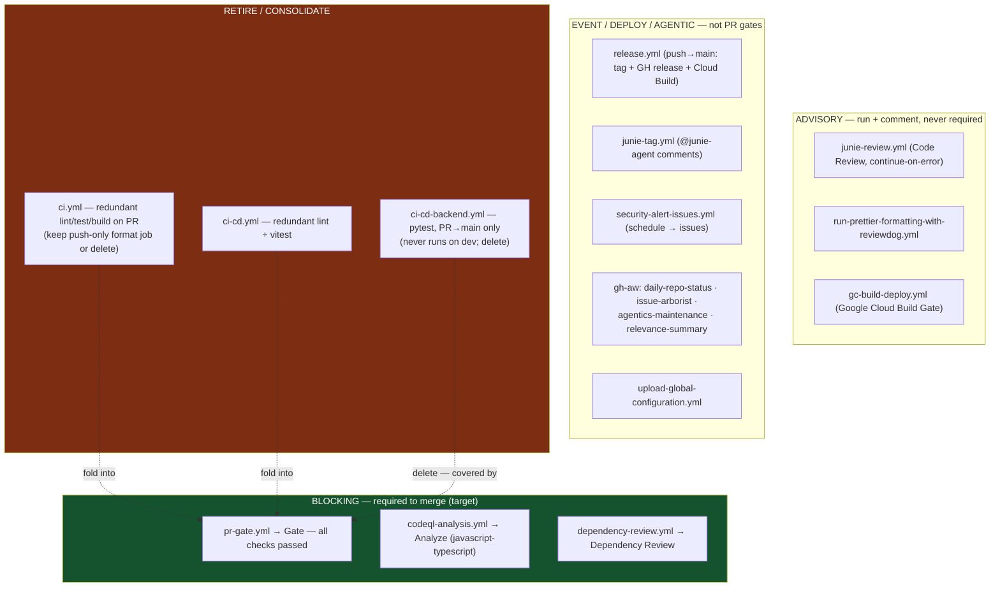

# Workflow Map — every cookbook workflow, classified (2026-07-15)

GitHub-renderable Mermaid source. Which workflows should be **blocking**
(required to merge), which are **advisory** (run, comment, never block), and
which are **event/deploy** (fire on tags, schedules, or comments). Canonical
context: [SPEC-01](SPEC-01-ci-quality-gates.md) ·
[SPEC-02](SPEC-02-ai-and-deploy-workflows.md).

| Workflow | Today's trigger | Class | Action |
|---|---|---|---|
| `pr-gate.yml` | PR `[main,dev,dev/**]` | **Blocking** | Keep; make `gate` a required context |
| `codeql-analysis.yml` | PR `[main,dev]` + weekly | **Blocking** | Keep; require `Analyze (javascript-typescript)` |
| `dependency-review.yml` | PR `[main,dev]` | **Blocking** | Keep; optionally require |
| `ci.yml` | push+PR `[main,dev,dev/**]` | Redundant | Trim to push-only format, or delete |
| `ci-cd.yml` | push `main`+tags, PR `[main,dev,dev/**]` | Redundant | Delete (folded into pr-gate) |
| `ci-cd-backend.yml` | push `main`+tags, PR `[main]` | Redundant+narrow | Delete (never runs on `dev`) |
| `release.yml` | push `main` | Deploy | Keep unchanged |
| `gc-build-deploy.yml` | push `**` + PR all | Advisory/deploy | Scope triggers; keep out of required |
| `junie-review.yml` | PR `[main]` | Advisory | Keep out of required |
| `run-prettier-...-reviewdog.yml` | PR `[main,dev]` | Advisory | Keep out of required |
| `junie-tag.yml` | `@junie-agent` events | Event | Unchanged |
| `security-alert-issues.yml` | schedule + dispatch | Event | Unchanged |
| gh-aw (`daily-repo-status`, `issue-arborist`, `agentics-maintenance`, `relevance-summary`) | schedule / dispatch | Agentic | Unchanged, never required |
| `upload-global-configuration.yml` | — | Event | Unchanged |
